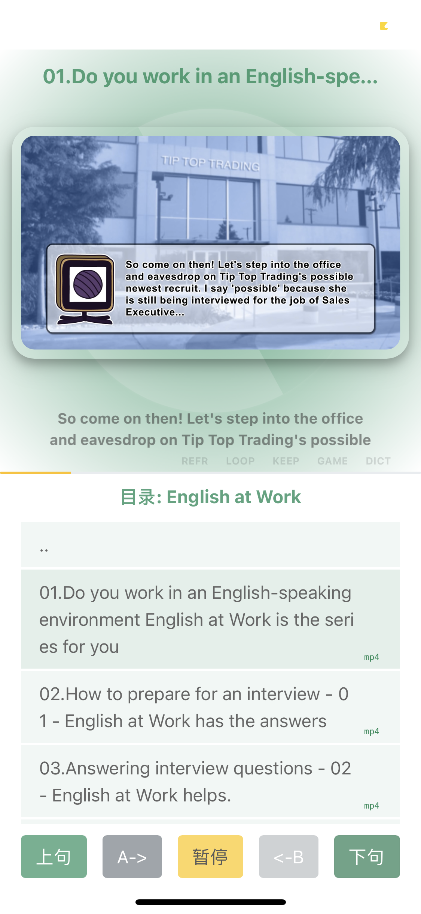
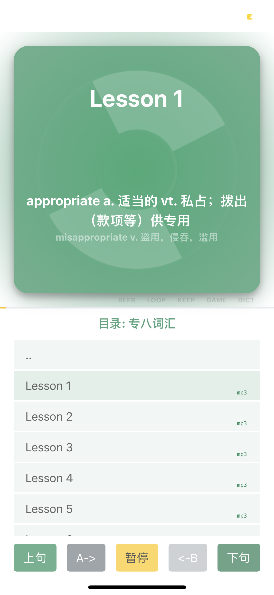
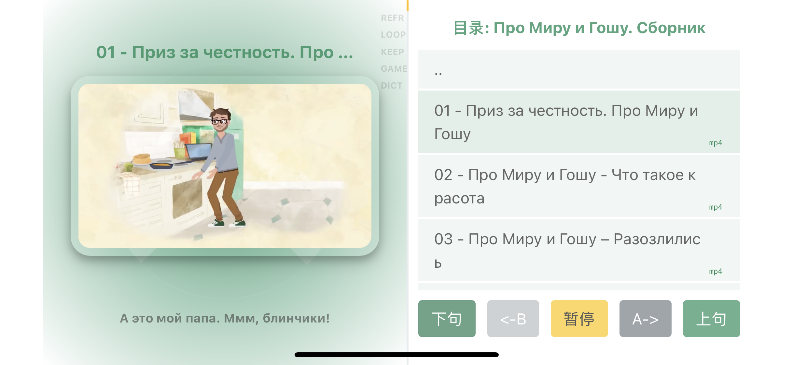

# Player working with nginx
Watch/Listen videos/audios sentence by sentence.

## Folder structure

* /SomePath/Player    -- this source folder
* /SomePath/English   -- Path to store data

## Screenshots

